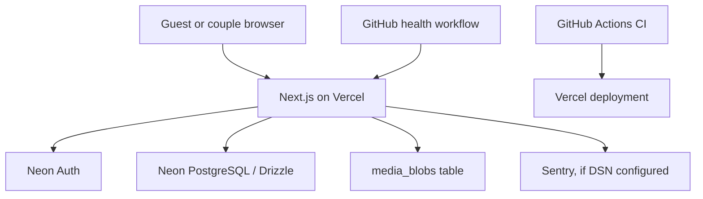

# Wisal Architecture — audited baseline

## Scope and evidence

Audited revision: `a7e48a8` (`feat(ops): add preview-only sentry smoke check`). Evidence combines source and schema review, a live public-session review of `https://wisal-self.vercel.app/`, and local quality-gate execution. No production secret, database record, authenticated account, or payment was modified. Authenticated runtime and two-account authorization checks remain release-gate tests, not verified facts.

## Runtime architecture

| Layer | Verified implementation |
|---|---|
| Web | Next.js 16.3 App Router, React 19, TypeScript, Turbopack build |
| Styling | Global CSS (`app/globals.css`, `app/wisal-atlas.css`); self-hosted Manrope, Cormorant Garamond, IBM Plex Sans Arabic, Noto Naskh Arabic |
| Client state | Component-local React state; `useWisalLocale` persists locale in `localStorage` |
| Authentication | Neon Auth via `@neondatabase/auth`; Better Auth-compatible route handler at `/api/auth/[...path]`; Neon session cookies |
| Data | Neon PostgreSQL; Drizzle ORM for product data and raw Neon SQL for blob storage/rate limiting |
| API | Next Route Handlers; owner-scoped service functions in `lib/wisal-data.ts`; public RSVP/open endpoints guarded separately |
| Object storage | `media_blobs` PostgreSQL table, accessed through `lib/wisal-storage.ts`; not a dedicated object store |
| Deployment | Vercel, Frankfurt (`fra1`) region; GitHub Actions CI and 15-minute `/api/health` monitor |
| Monitoring | Sentry client/server/edge configuration present; preview-only authenticated smoke route |
| Payments | Manual transfer request, receipt upload/review, immutable plan snapshot, subscriptions and audit log |

## Deployment flow

## Module map

| Module | Status | Primary files |
|---|---|---|
| Marketing site/catalog | Implemented | `app/page.tsx`, `app/layout.tsx` |
| Email/password + Google entry | Implemented with account-linking limitation | `app/auth/*`, `lib/auth/*` |
| Workspace/event dashboard | Implemented, authenticated | `app/workspace/page.tsx`, `app/page.tsx` |
| Invitation studio | Implemented inside the large `app/page.tsx` client module | `app/page.tsx`, `lib/wisal-data.ts` |
| Public invitation + RSVP | Implemented | `app/invite/[slug]/*`, `app/api/rsvp/route.ts` |
| Guests, groups, segments | Implemented | `app/api/events/[id]/*`, `db/schema.ts` |
| Personalised access | Implemented server-side in data service; requires two-account/guest E2E proof | `lib/wisal-data.ts`, `guest_segment_access` |
| Messages | Drafting/queue and manual WhatsApp preparation only | `app/page.tsx`, `messages` |
| Payments | Manual receipt workflow | `app/checkout/*`, `app/api/payments/*` |
| Administration | Role-gated users, templates, plans, content, support, payment review, audit | `app/admin/*`, `lib/admin-*` |
| Support + notifications | Implemented | `app/account-center.tsx`, `app/api/support-tickets`, `app/api/notifications` |

## Data model summary

Core ownership is `users → events → invitations / guests / segments / groups / messages`. Guest groups map to segments through `guest_segment_access`; guests map to one group through `guest_group_memberships`. RSVP is persisted both at guest level and per segment. Payment requests preserve the purchased plan snapshot and subscriptions represent entitlement.

Strengths: UUID primary keys, foreign keys with intentional cascade/set-null behavior, unique guest invite tokens, indexes for owner/event/status and guest access paths, PostgreSQL constraints, additive migration history, and immutable payment snapshots.

Architecture concerns:

- `app/page.tsx` (1,446 lines) and `app/wisal-atlas.css` (1,604 lines) combine too many product concerns. This raises regression and review cost.
- `media_blobs` stores base64-decoded binary in the primary database. It is workable for small receipts/covers but couples image/PDF traffic, database size, backups, and serverless response cost.
- The schema and creation fallbacks still default several persisted records to Arabic while the UI default is English; see WIS-002.
- No worker/provider executes messages scheduled in the database. A scheduled record is an operational reminder, not delivery.

## Security controls present

- Owner lookup is applied before event mutation/read paths; sensitive admin routes use a server-side permission matrix.
- Public RSVP and open tracking use bounded bodies, same-origin checks when an `Origin` is present, shared database rate limits, no-store responses, and token validation.
- Private invitations require a guest token at the data layer; invitation metadata is configured noindex and strips tokens from canonical URLs.
- CSP, `nosniff`, referrer policy, frame restrictions, secure health output, audit records, receipt ownership checks, and payment state-version guards are implemented.

These controls are a strong base, but their production configuration and cross-account behavior must be verified before launch.

## Required production configuration

`DATABASE_URL`, `WISAL_AUTH_PROVIDER=neon`, `NEON_AUTH_BASE_URL`, `NEON_AUTH_COOKIE_SECRET` (32+ characters), `PLATFORM_OWNER_EMAIL`, `NEXT_PUBLIC_SITE_URL`, and the optional Sentry DSN/token are declared in `.env.example`. Vercel variable values and Neon Auth callback/provider settings were not visible to this audit and must be verified using the launch checklist.

